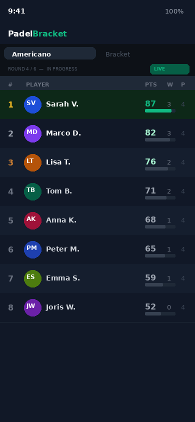
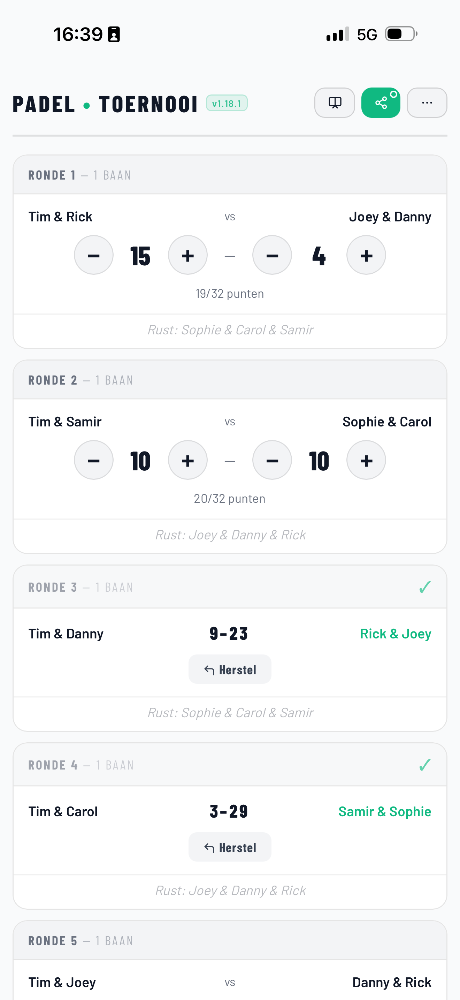
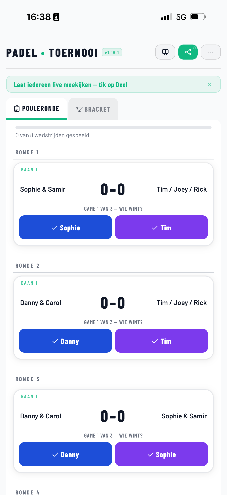
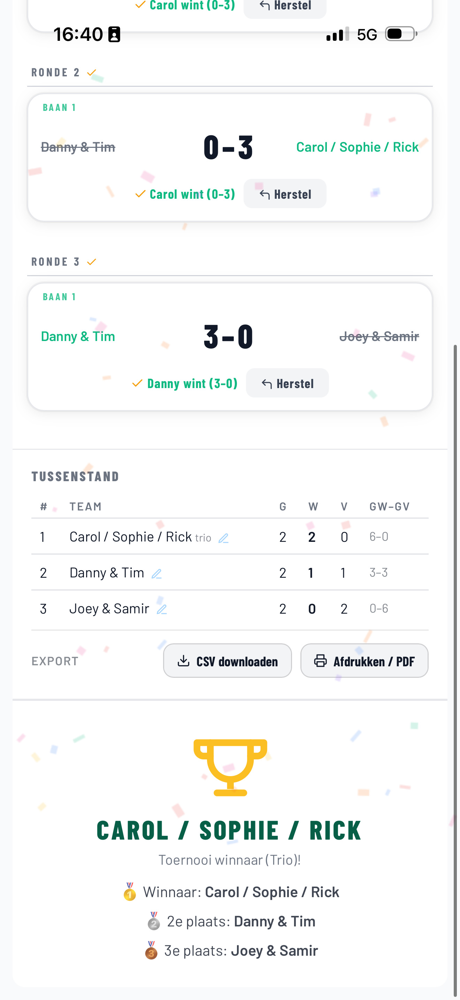

# PadelBracket — Free Padel Tournament Generator

**Live site: [padel-bracket.com](https://padel-bracket.com)**

Generate a complete padel tournament in seconds — Americano, Mexicano, Mixicano, Team Americano, Team Mexicano, King of the Court, Knockout bracket or Round Robin. No account, no installation, works offline. Free.

---

## Screenshots

<p float="left">
  
  
  
  
</p>

---

## Features

- **8 tournament formats** — Americano, Mexicano, Mixicano, Team Americano, Team Mexicano, King of the Court, Knockout bracket, Round Robin
- **Live standings** — scores update in real time on every phone via a share link
- **Self-signup with waitlist**: share a link before the tournament, players add their own name, full lists overflow automatically to a waitlist
- **Personal player view**: every player picks their own name once on the share link and always sees their court, partner, opponents and personal stats, with a notification when a new round is ready
- **Fullscreen TV scoreboard** — present the tournament on any screen via `?pres=1`
- **Player score entry** — share a link so players enter their own scores on court
- **No account needed** — open and start, nothing to install or sign up for
- **Works offline** — installable as a PWA; the app works without internet after the first load
- **6 languages** — Dutch, English, French, German, Spanish, Swedish
- **Export** — copy standings as text, export CSV, or print/PDF results
- **Printable schedules** — pre-computed rotation tables for 4, 6, 8, 10, 12 and 16 players

---

## Formats

| Format | Best for | Partners |
|--------|----------|----------|
| **Americano** | Any group, classic rotation | Fixed rotation schedule |
| **Mexicano** | Competitive groups | Based on live standings |
| **Mixicano** | Mixed-gender groups | Rotating mixed (M/W) pairs, based on standings |
| **Team Americano** | Established pairs | Fixed pairs, rotating opponents |
| **Team Mexicano** | Established pairs, competitive | Fixed pairs, opponents based on live standings |
| **King of the Court** | Competitive ladder play | Rotating partners, promotion/relegation by court |
| **Knockout** | Elimination tournaments | Fixed teams |
| **Round Robin** | Everyone vs everyone | Fixed teams |

---

## How it works

1. Enter player names (or team names for Knockout/Round Robin)
2. Choose a format and number of courts
3. Tap **Start** — the schedule is generated instantly
4. Enter scores after each match — standings update live
5. Share a link so spectators follow along on their own phone

---

## Stack

- **Single-file PWA** — `app/index.html` (~4700 lines, no build step, no framework)
- **Hosting** — GitHub Pages, deployed automatically via `.github/workflows/deploy.yml`
- **Live sharing backend** — Supabase (PostgreSQL + realtime), stores tournament state by 6-char share code
- **Offline** — Service worker caches the app shell after first load
- **Analytics** — Google Analytics 4 with consent gate (no cookies without opt-in)

---

## Local development

```bash
# Clone and serve — no build step needed
git clone https://github.com/DannydeVis/padel-toernooi.git
cd padel-toernooi
npx serve .        # or: python3 -m http.server 8080
# open http://localhost:3000/app/
```

---

## Links

- **Live app** — [padel-bracket.com/app/](https://padel-bracket.com/app/)
- **Americano guide** — [padel-bracket.com/americano/](https://padel-bracket.com/americano/)
- **Mexicano guide** — [padel-bracket.com/mexicano/](https://padel-bracket.com/mexicano/)
- **Mixicano guide**: [padel-bracket.com/mixicano/](https://padel-bracket.com/mixicano/)
- **Team Mexicano guide**: [padel-bracket.com/team-mexicano/](https://padel-bracket.com/team-mexicano/)
- **King of the Court guide**: [padel-bracket.com/king-of-the-court/](https://padel-bracket.com/king-of-the-court/)
- **Printable schedule (8 players)** — [padel-bracket.com/americano/8-players/](https://padel-bracket.com/americano/8-players/)
